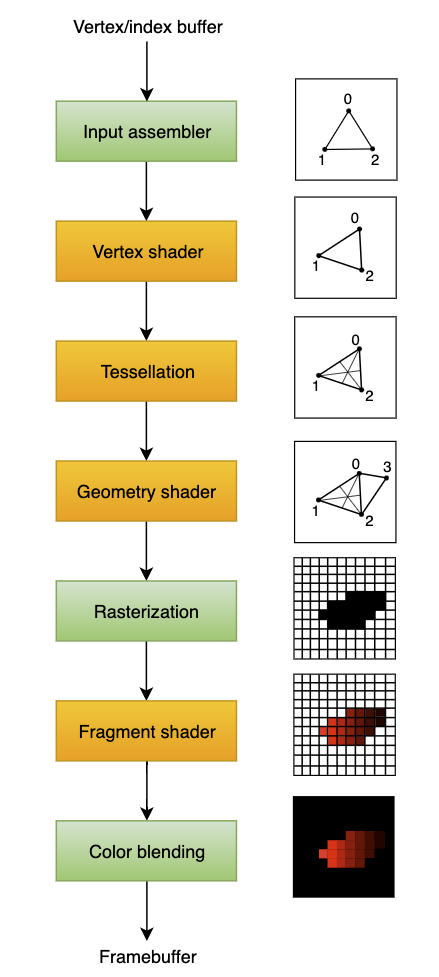
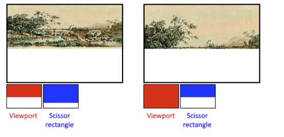

# Vulkan Init 

<!-- vscode-markdown-toc -->
* [Initialization](#Initialization)
	* [Vulkan Objects Methods](#VulkanObjectsMethods)
	* [GLFW](#GLFW)
	* [mainloop](#mainloop)
* [Instance](#Instance)
	* [Vulkan Extensions](#VulkanExtensions)
	* [Common Pattern for Creating Vulkan Objects](#CommonPatternforCreatingVulkanObjects)
	* [VkResult from vulkan methods](#VkResultfromvulkanmethods)
	* [Cleaning up VK Objects](#CleaningupVKObjects)
* [Validation Layer](#ValidationLayer)
	* [Types of Validation Layers](#TypesofValidationLayers)
	* [VK_LAYER_KHRONOS_validation](#VK_LAYER_KHRONOS_validation)
* [Physical Devices & Queue Families](#PhysicalDevicesQueueFamilies)
	* [GPU Device](#GPUDevice)
	* [Array of all devices](#Arrayofalldevices)
	* [Check what stuff device supports](#Checkwhatstuffdevicesupports)
* [Queue Families](#QueueFamilies)
	* [findQueueFamilies](#findQueueFamilies)
* [Logical Devices and Queues](#LogicalDevicesandQueues)
* [Presenting: Surfaces](#Presenting:Surfaces)
	* [More queues](#Morequeues)
* [SwapChain](#SwapChain)
	* [Enabling](#Enabling)
	* [Compatibility with Window Surface](#CompatibilitywithWindowSurface)
	* [Swap Chain Settings](#SwapChainSettings)
		* [Surface Format](#SurfaceFormat)
		* [Presentation Mode](#PresentationMode)
		* [Swap Extent](#SwapExtent)
	* [Creating Swap Chain](#CreatingSwapChain)
* [Image Views](#ImageViews)
	* [VKImage](#VKImage)
	* [VKImageView](#VKImageView)
	* [Creating ImageView](#CreatingImageView)
	* [viewType](#viewType)
	* [format](#format)
	* [components & swizzling](#componentsswizzling)
	* [subresourceRange](#subresourceRange)
	* [Creating the ImageView vkCreateImageView](#CreatingtheImageViewvkCreateImageView)
* [Graphics Pipeline](#GraphicsPipeline)
	* [Input Assembler](#InputAssembler)
	* [Vertex Shader](#VertexShader)
	* [Tesselation Shaders](#TesselationShaders)
	* [Geometry Shader](#GeometryShader)
	* [Rasterisation stage](#Rasterisationstage)
	* [Fragment Shader](#FragmentShader)
	* [Color Blending](#ColorBlending)
* [Graphics Pipeline Mutability](#GraphicsPipelineMutability)
	* [Immutable](#Immutable)
	* [Shadow Maps](#ShadowMaps)
* [Shader Modules](#ShaderModules)
	* [SPIR-V](#SPIR-V)
	* [Why bytecode?](#Whybytecode)
	* [Problems with GLSL/HLSL](#ProblemswithGLSLHLSL)
	* [Compiling vs Runtime](#CompilingvsRuntime)
	* [Tools](#Tools)
	* [Glsl basics](#Glslbasics)
	* [Vertex Shader](#VertexShader-1)
	* [Clip Coordinate & Homogeneous Coordinates](#ClipCoordinateHomogeneousCoordinates)
	* [Z-Coordinate](#Z-Coordinate)
	* [GL_ARB_separate_shader_objects](#GL_ARB_separate_shader_objects)
	* [Sending out attributes with layout](#Sendingoutattributeswithlayout)
	* [gl_Position is a special attribute from vertex shader](#gl_Positionisaspecialattributefromvertexshader)
	* [in and out params](#inandoutparams)
* [ShaderModules (VKShaderModule)](#ShaderModulesVKShaderModule)
	* [SPIRV use in Graphics Pipeline](#SPIRVuseinGraphicsPipeline)
	* [VkPipelineShaderStageCreateInfo](#VkPipelineShaderStageCreateInfo)
	* [pSpecializationInfo](#pSpecializationInfo)
* [Fixed functions](#Fixedfunctions)
	* [Vertex Input](#VertexInput)
	* [VkPipelineInputAssemblyStateCreateInfo](#VkPipelineInputAssemblyStateCreateInfo)
	* [ViewPorts and Scissors](#ViewPortsandScissors)
	* [Filtering image with Scissor Rectangles + Viewport](#FilteringimagewithScissorRectanglesViewport)
	* [Rasterizer](#Rasterizer)
	* [Non fill modes need](#Nonfillmodesneed)
	* [Face culling](#Faceculling)
	* [Depth properties](#Depthproperties)
	* [Multisampling for anti-aliasing](#Multisamplingforanti-aliasing)
	* [Depth and stencil testing](#Depthandstenciltesting)
	* [Color Blending](#ColorBlending-1)
	* [Dynamic State (changing pipeline without restart)](#DynamicStatechangingpipelinewithoutrestart)
	* [Pipeline layout](#Pipelinelayout)
* [Render Passes](#RenderPasses)

<!-- vscode-markdown-toc-config
	numbering=false
	autoSave=true
	/vscode-markdown-toc-config -->
<!-- /vscode-markdown-toc -->

From the official documentation [here](https://vulkan-tutorial.com/en)

## <a name='Initialization'></a>Initialization
- [Doc: Base Code](https://vulkan-tutorial.com/Drawing_a_triangle/Setup/Base_code)

### <a name='VulkanObjectsMethods'></a>Vulkan Objects Methods
- vkCreateXXX
- vkAllocateXXX 
- vkDestroyXXX
- vkFreeXXX
- They all share one parameter `pAllocator` default use `nullptr`
    - This gets a custom callback for custom memory allocation

### <a name='GLFW'></a>GLFW
- Window stuff
- glfwInit()
- Disable OpenGL: `glfwWindowHint(GLFW_CLIENT_API, GLFW_NO_API);
- Creating window

```c++
// width, height, title, which window to start on 
window = glfwCreateWindow(800, 600, "Vulkan", nullptr, nullptr);
```

### <a name='mainloop'></a>mainloop

```c++
    void mainLoop() {
        while (!glfwWindowShouldClose(window)) {
            glfwPollEvents();
        }
    }
```

-----------------------------------------------------------

## <a name='Instance'></a>Instance
- [Doc: Instance](https://vulkan-tutorial.com/en/Drawing_a_triangle/Setup/Instance)
- VKInstance requires `#include <vulkan/vulkan.h>`

```c++
    void createInstance() {
        VkApplicationInfo appInfo{};
        appInfo.sType = VK_STRUCTURE_TYPE_APPLICATION_INFO;
        appInfo.pApplicationName = "Hello Triangle";
        appInfo.applicationVersion = VK_MAKE_VERSION(1, 0, 0);
        appInfo.pEngineName = "No Engine";
        appInfo.engineVersion = VK_MAKE_VERSION(1, 0, 0);
        appInfo.apiVersion = VK_API_VERSION_1_0;

        VkInstanceCreateInfo createInfo{};
        createInfo.sType = VK_STRUCTURE_TYPE_INSTANCE_CREATE_INFO;
        createInfo.pApplicationInfo = &appInfo;

        uint32_t glfwExtensionCount = 0;
        const char** glfwExtensions;
        glfwExtensions = glfwGetRequiredInstanceExtensions(&glfwExtensionCount);

        createInfo.enabledExtensionCount = glfwExtensionCount;
        createInfo.ppEnabledExtensionNames = glfwExtensions;

        createInfo.enabledLayerCount = 0;

        if (vkCreateInstance(&createInfo, nullptr, &instance) != VK_SUCCESS) {
            throw std::runtime_error("failed to create instance!");
        }
```

### <a name='VulkanExtensions'></a>Vulkan Extensions
- Vulkan needs to enable extensions for window drawing from glfw
- See this 

```c++
        uint32_t glfwExtensionCount = 0;
        const char** glfwExtensions;
        glfwExtensions = glfwGetRequiredInstanceExtensions(&glfwExtensionCount);
        createInfo.enabledExtensionCount = glfwExtensionCount;
        createInfo.ppEnabledExtensionNames = glfwExtensions;
```

### <a name='CommonPatternforCreatingVulkanObjects'></a>Common Pattern for Creating Vulkan Objects

- Pointer to struct with creation info
- Pointer to custom allocator callbacks, always nullptr in this tutorial
- Pointer to the variable that stores the handle to the new object
- e.g. `VkResult result = vkCreateInstance(&createInfo, nullptr, &instance);`

### <a name='VkResultfromvulkanmethods'></a>VkResult from vulkan methods
-  that is either VK_SUCCESS or an error code
- Can check this

```c++
if (vkCreateInstance(&createInfo, nullptr, &instance) != VK_SUCCESS) {
    throw std::runtime_error("failed to create instance!");
}
```

### <a name='CleaningupVKObjects'></a>Cleaning up VK Objects

```c++
void cleanup() {
    vkDestroyInstance(instance, nullptr);
```

-----------------------------------------------------------

## <a name='ValidationLayer'></a>Validation Layer
- [Doc: Validation Layer](https://vulkan-tutorial.com/en/Drawing_a_triangle/Setup/Validation_layers)
- Vulkan does `VERY LITTLE ERROR CHECKING` which can result in crashes or undefined behaviour 
- Validation Layers `hook into Vulkan function calls` to apply additional operations such as
    - Checking the values of parameters against the specification to detect misuse
    - Tracking creation and destruction of objects to find resource leaks
    - Checking thread safety by tracking the threads that calls originate from
    - Logging every call and its parameters to the standard output
    - Tracing Vulkan calls for profiling and replaying


### <a name='TypesofValidationLayers'></a>Types of Validation Layers
- two different types of validation layers in Vulkan: instance and device specific. 

### <a name='VK_LAYER_KHRONOS_validation'></a>VK_LAYER_KHRONOS_validation
- All standard validations are bundled in this 

```c++
const std::vector<const char*> validationLayers = {
    "VK_LAYER_KHRONOS_validation"
};

#ifdef NDEBUG
    const bool enableValidationLayers = false;
#else
    const bool enableValidationLayers = true;
#endif
```

-----------------------------------------------------------

## <a name='PhysicalDevicesQueueFamilies'></a>Physical Devices & Queue Families
- [Docs: Physical Devices & Queue Families](https://vulkan-tutorial.com/en/Drawing_a_triangle/Setup/Physical_devices_and_queue_families)

### <a name='GPUDevice'></a>GPU Device
- The graphics card that we'll end up selecting will be stored in a VkPhysicalDevice handle
- `VkPhysicalDevice physicalDevice = VK_NULL_HANDLE;`
    - This object will be implicitly destroyed when the VkInstance is destroyed, 

### <a name='Arrayofalldevices'></a>Array of all devices

```C++
uint32_t deviceCount = 0;
std::vector<VkPhysicalDevice> devices(deviceCount);
vkEnumeratePhysicalDevices(instance, &deviceCount, devices.data());
```

### <a name='Checkwhatstuffdevicesupports'></a>Check what stuff device supports
- See vkGetPhysicalDeviceProperties.

```c++
VkPhysicalDeviceProperties deviceProperties;
vkGetPhysicalDeviceProperties(device, &deviceProperties);
```

## <a name='QueueFamilies'></a>Queue Families
- Different queue families have different functionalities
- e.g. a queue family that only allows processing of compute commands or one that only allows memory transfer related commands.

### <a name='findQueueFamilies'></a>findQueueFamilies
- Look for queue with supported Graphics commands
- Use std optional to say whether it exists or not 


-----------------------------------------------------------

## <a name='LogicalDevicesandQueues'></a>Logical Devices and Queues 
- [Logical Devices and Queues](https://vulkan-tutorial.com/en/Drawing_a_triangle/Setup/Logical_device_and_queues)
- After selecting a physical device to use we need to set up a logical device to interface with it


-----------------------------------------------------------
## <a name='Presenting:Surfaces'></a>Presenting: Surfaces
- [Surfaces](https://vulkan-tutorial.com/Drawing_a_triangle/Presentation/Window_surface)
- VkSurfaceKHR surface;
- Comes with glfw as an extension in order to talk to vulkan

```c++

    void createSurface() {
        if (glfwCreateWindowSurface(instance, window, nullptr, &surface) != VK_SUCCESS) {
            throw std::runtime_error("failed to create window surface!");
        }
    }
```

### <a name='Morequeues'></a>More queues

- Present Family queue 

```c++
VkQueue graphicsQueue;
VkQueue presentQueue;

struct QueueFamilyIndices {
    std::optional<uint32_t> graphicsFamily;
    std::optional<uint32_t> presentFamily;

    bool isComplete() {
        return graphicsFamily.has_value() && presentFamily.has_value();
    }
};
```

- Present may not be applicable think server side gpu

```c++

            VkBool32 presentSupport = false;
            vkGetPhysicalDeviceSurfaceSupportKHR(device, i, surface, &presentSupport);

            if (presentSupport) {
                indices.presentFamily = i;
            }
```

- Create the new queue for the `logical device` (1to1 with physical gfx device)


-----------------------------------------------------------


## <a name='SwapChain'></a>SwapChain

### <a name='Enabling'></a>Enabling 
just like validation layer extensions swapchain is an extension to vulkan

```c++
const std::vector<const char*> validationLayers = {
    "VK_LAYER_KHRONOS_validation"
};

const std::vector<const char*> deviceExtensions = {
    VK_KHR_SWAPCHAIN_EXTENSION_NAME
};
```

- Enabling requires adding this to the Logical Device creation 
- In createLogicalDevice()

```c++

        createInfo.enabledExtensionCount = static_cast<uint32_t>(deviceExtensions.size());
        createInfo.ppEnabledExtensionNames = deviceExtensions.data();
```

### <a name='CompatibilitywithWindowSurface'></a>Compatibility with Window Surface
- Swap chain may not be compatible with the glfw window surface so we need to query the following:
    - Basic surface capabilities (min/max number of images in swap chain, min/max width and height of images)
    - Surface formats (pixel format, color space)
    - Available presentation modes
    

### <a name='SwapChainSettings'></a>Swap Chain Settings

- Surface format (color depth)
- Presentation mode (conditions for "swapping" images to the screen)
- Swap extent (resolution of images in swap chain)

#### <a name='SurfaceFormat'></a>Surface Format
- e.g. Surface can support color channels and types
- `VK_FROMAT_B8G8R8A_SRGB`a
- Can do a ranking of different formats to choose which one is best

#### <a name='PresentationMode'></a>Presentation Mode
- Presents the actual conditions for showing images to the screen
- Modes:
    - `VK_PRESENT_MODE_IMMEDIATE_KHR`: Images submitted right away to screen without tearing
    - `VK_PRESENT_MODE_FIFO_KHR`: FIFO queue similar to vertical sync
    - `VK_PRESENT_MODE_FIFO_RELAXED_KHR` 
    - `VK_PRESENT_MODE_MAILBOX_KHR`: triple bufferring

- `VK_PRESENT_MODE_FIFO_KHR` guaranteed to be there

#### <a name='SwapExtent'></a>Swap Extent 
- Resolution of swap chain images 
- Read up on it more [here](https://vulkan-tutorial.com/en/Drawing_a_triangle/Presentation/Swap_chain)

### <a name='CreatingSwapChain'></a>Creating Swap Chain

```c++

void createSwapChain() {
    SwapChainSupportDetails swapChainSupport = querySwapChainSupport(physicalDevice);

    VkSurfaceFormatKHR surfaceFormat = chooseSwapSurfaceFormat(swapChainSupport.formats);
    VkPresentModeKHR presentMode = chooseSwapPresentMode(swapChainSupport.presentModes);
    VkExtent2D extent = chooseSwapExtent(swapChainSupport.capabilities);
}
```

- set min amount of images + 1 (+1) as acquiring images setting this is better
- set max image count 
- create swapchaininfo struct 
- Set the surface format and colorspace properties

```c++
createInfo.imageFormat = surfaceFormat.format;
createInfo.imageColorSpace = surfaceFormat.colorSpace;
```

-----------------------------------------------------------

## <a name='ImageViews'></a>Image Views
- [Image Views](https://vulkan-tutorial.com/en/Drawing_a_triangle/Presentation/Image_views)

### <a name='VKImage'></a>VKImage
- Used in the swap chain 
- In order to use it we need to create a `VKImageView` object 

### <a name='VKImageView'></a>VKImageView
- View into an Image describes:
    - How to access the image
    - Which part of the image to access

```c++
std::vector<VkImageView> swapChainImageViews;

void createImageViews() {
    swapChainImageViews.resize(swapChainImages.size());
    ...
}

```

- Need to destroy when instance is destroyed

### <a name='CreatingImageView'></a>Creating ImageView

```c++
        for (size_t i = 0; i < swapChainImages.size(); i++) {
            VkImageViewCreateInfo createInfo{};
            createInfo.sType = VK_STRUCTURE_TYPE_IMAGE_VIEW_CREATE_INFO;
            createInfo.image = swapChainImages[i];
```

sType = VK_STRUCTURE_TYPE_IMAGE_VIEW_CREATE_INFO

Iterating through each swapChainimage... which is `std::vector<VkImage> swapChainImages;`

### <a name='viewType'></a>viewType

```
createInfo.viewType = VK_IMAGE_VIEW_TYPE_2D;
```

What's a view type?

```c
typedef enum VkImageViewType {
    VK_IMAGE_VIEW_TYPE_1D = 0,
    VK_IMAGE_VIEW_TYPE_2D = 1,
    VK_IMAGE_VIEW_TYPE_3D = 2,
    VK_IMAGE_VIEW_TYPE_CUBE = 3,
    VK_IMAGE_VIEW_TYPE_1D_ARRAY = 4,
    VK_IMAGE_VIEW_TYPE_2D_ARRAY = 5,
    VK_IMAGE_VIEW_TYPE_CUBE_ARRAY = 6,
    VK_IMAGE_VIEW_TYPE_MAX_ENUM = 0x7FFFFFFF
} VkImageViewType;
```

### <a name='format'></a>format

```
    VkFormat swapChainImageFormat;
```

Created in the swapchain 

```
        swapChainImageFormat = surfaceFormat.format;
        swapChainExtent = extent;
```

Grabbed from the surfaceFormat (glfw)

```
        VkSurfaceFormatKHR surfaceFormat = chooseSwapSurfaceFormat(swapChainSupport.formats);
```

here

```c++

    VkSurfaceFormatKHR chooseSwapSurfaceFormat(const std::vector<VkSurfaceFormatKHR>& availableFormats) {
        for (const auto& availableFormat : availableFormats) {
            if (availableFormat.format == VK_FORMAT_B8G8R8A8_SRGB && availableFormat.colorSpace == VK_COLOR_SPACE_SRGB_NONLINEAR_KHR) {
                return availableFormat;
            }
        }

        return availableFormats[0];
```

### <a name='componentsswizzling'></a>components & swizzling

```c++
createInfo.components.r = VK_COMPONENT_SWIZZLE_IDENTITY;
createInfo.components.g = VK_COMPONENT_SWIZZLE_IDENTITY;
createInfo.components.b = VK_COMPONENT_SWIZZLE_IDENTITY;
createInfo.components.a = VK_COMPONENT_SWIZZLE_IDENTITY;
```

- Allows for color swizziling 
- What's color swizziling? 

In computer graphics, swizzling is the ability to compose vectors by arbitrarily rearranging and combining components of other vectors.

For example, if `A = {1,2,3,4}`, where the components are x, y, z, and w respectively, you could compute `B = A.wwxy`, whereupon B would equal {4,4,1,2}. Additionally, combining two two-component vectors can create a four-component vector, or any combination of vectors and swizzling. This is common in GPGPU applications

### <a name='subresourceRange'></a>subresourceRange 

Describes which part of the image to access 

```c++
createInfo.subresourceRange.aspectMask = VK_IMAGE_ASPECT_COLOR_BIT;
createInfo.subresourceRange.baseMipLevel = 0;
createInfo.subresourceRange.levelCount = 1;
createInfo.subresourceRange.baseArrayLayer = 0;
createInfo.subresourceRange.layerCount = 1;
```

Above is no mipmapping or multiple layers 

Use multiple layers for `steroscopic 3d applications` https://en.wikipedia.org/wiki/Stereoscopy

### <a name='CreatingtheImageViewvkCreateImageView'></a>Creating the ImageView vkCreateImageView

```
if (vkCreateImageView(device, &createInfo, nullptr, &swapChainImageViews[i]) != VK_SUCCESS) {
    throw std::runtime_error("failed to create image views!");
}
```

-----------------------------------------------------------

## <a name='GraphicsPipeline'></a>Graphics Pipeline



### <a name='InputAssembler'></a>Input Assembler
- Collect raw vertex data
- Can use an `index buffer` for duplicated vertex data

### <a name='VertexShader'></a>Vertex Shader
- `Programmable`
- For every vertices applies transformations
- Vertex position to Screen Space
- Pass each vertices to next

### <a name='TesselationShaders'></a>Tesselation Shaders
- `Programmable`
- Subdivide geometry based on `rules`
- e.g. make surfaces look like brick walls, staircases look not flat

### <a name='GeometryShader'></a>Geometry Shader
- `Programmable`
- Run on the incoming input primitive (point, triangle, line) 
- discard things or create more primitives
- similar to the tesselation shader
- `Performance is not good except on Intel's integrated GPU's`

### <a name='Rasterisationstage'></a>Rasterisation stage
- From primitives into `fragments`
- Pixel elements that fill on the `framebuffer` 
- This will discard any fragments that `fall outside the screen`
- Attributes from the vertex shader is `interpolated across fragments`
- Does `Depth Testing` anything behind other framgnets are discarded

### <a name='FragmentShader'></a>Fragment Shader
- `Programmable`
- Fragments that survive in the framebuffers are `written to and with a color and depth value`
- Interpolates data from the vertex shader including `texture coodinates and normals for lighting`

### <a name='ColorBlending'></a>Color Blending
- Mix different fragments that map to same pixel in framebuffer


## <a name='GraphicsPipelineMutability'></a>Graphics Pipeline Mutability 

### <a name='Immutable'></a>Immutable 
The graphics pipeline in Vulkan is almost completely immutable, so you must recreate the pipeline from scratch if you want to change shaders, bind different framebuffers or change the blend function

You'll need to create many pipelines that will be used in the rendering operations 

### <a name='ShadowMaps'></a>Shadow Maps
- When you would disable the fragment shader to produce shadows
- [Wiki](https://en.wikipedia.org/wiki/Shadow_mapping)

-----------------------------------------------------------

## <a name='ShaderModules'></a>Shader Modules

### <a name='SPIR-V'></a>SPIR-V 
- A bytecode format that can be used with `Vulkan and OpenCL`
- Needs to be compiled (can be from GLSL or HLSL)

### <a name='Whybytecode'></a>Why bytecode?
- Turning shader code into native code with bytecode is significantly less complex

### <a name='ProblemswithGLSLHLSL'></a>Problems with GLSL/HLSL
- When shader code becomes quite big with syntax errors and is non trivial then `vendor's drivers could reject your code`

### <a name='CompilingvsRuntime'></a>Compiling vs Runtime
- Compile to see any issues
- Can also include a runtime library to produce spirv at runtime

### <a name='Tools'></a>Tools
- `glslangValidator`
- `glslc` - GLSLc compiler 
- You can use functionality like `includes` (nice!)

### <a name='Glslbasics'></a>Glsl basics
- vec3 for vector 3 
- vec3(1.0,2.0,3.0).xy produces a vec2
- Can compose vec3 and vec2  e.g. vec3(vec2(1,2), 1) to produce a vec3

### <a name='VertexShader-1'></a>Vertex Shader 

Processes every vertex and passes attributes like color, texture coordinates, normals and produces a final position and the attributes

passes to the rasterizer for interpolation over the fragments to produce a smooth gradient

### <a name='ClipCoordinateHomogeneousCoordinates'></a>Clip Coordinate & Homogeneous Coordinates
- Four dimensional vector from the vertex shader that is turned into a `normalized device coordinate` by `dividing the vector by its last component`
- Setting the fourth component to 1 will not change anything 


Now the frame buffer has (0,0) in the middle and `everything is between -1, 1`

### <a name='Z-Coordinate'></a>Z-Coordinate
- The Z coordinate now uses the same range as it does in Direct3D, from 0 to 1.

### <a name='GL_ARB_separate_shader_objects'></a>GL_ARB_separate_shader_objects
- See [here](https://www.khronos.org/registry/OpenGL/extensions/ARB/ARB_separate_shader_objects.txt)

### <a name='Sendingoutattributeswithlayout'></a>Sending out attributes with layout

```
layout(location = 0) out vec3 fragColor;
```

Where location = 0 specifies framebuffer 0 

Then in the main

```c++
void main() {
    gl_Position = vec4(positions[gl_VertexIndex], 0.0, 1.0);
    fragColor = colors[gl_VertexIndex];
}
```

### <a name='gl_Positionisaspecialattributefromvertexshader'></a>gl_Position is a special attribute from vertex shader
- Needs to be set and is vec 4 
- Custom out parameter specified fragColor

### <a name='inandoutparams'></a>in and out params

```c++
#version 450
#extension GL_ARB_separate_shader_objects : enable

layout(location = 0) in vec3 fragColor;

layout(location = 0) out vec4 outColor;

void main() {
    outColor = vec4(fragColor, 1.0);
}
```

Then coming in we have the layout being set and the in and out params 

## <a name='ShaderModulesVKShaderModule'></a>ShaderModules (VKShaderModule)

- Create similar to above with createInfo builder pattern

```c++
VkShaderModuleCreateInfo createInfo{};
createInfo.sType = VK_STRUCTURE_TYPE_SHADER_MODULE_CREATE_INFO;
createInfo.codeSize = code.size();
createInfo.pCode = reinterpret_cast<const uint32_t*>(code.data());
```

- Where code is the readFile `const std::vector<char>& code`

### <a name='SPIRVuseinGraphicsPipeline'></a>SPIRV use in Graphics Pipeline
- Shader modules are a wrapper around the SPIRV bytecode
- `Compilation and Linking` of this bytecode happens when graphics pipeline is created
- Shader modules Can be destroyed as soon as this is done 
- i.e. call this as soon as Grpahics pipeline init done

```c++
    vkDestroyShaderModule(device, fragShaderModule, nullptr);
    vkDestroyShaderModule(device, vertShaderModule, nullptr);
```

### <a name='VkPipelineShaderStageCreateInfo'></a>VkPipelineShaderStageCreateInfo
- We actually need to create Vertex & Fragment shader stages manually

```c++

        VkPipelineShaderStageCreateInfo vertShaderStageInfo{};
        vertShaderStageInfo.sType = VK_STRUCTURE_TYPE_PIPELINE_SHADER_STAGE_CREATE_INFO;
        vertShaderStageInfo.stage = VK_SHADER_STAGE_VERTEX_BIT;
        vertShaderStageInfo.module = vertShaderModule;
        vertShaderStageInfo.pName = "main";
```

### <a name='pSpecializationInfo'></a>pSpecializationInfo
- This is something you can add to the ShaderStageInfo 
- Allows you to specify `values for shader constants`
- e.g. you can load a shader stage with default preconfigured values
- This is more efficient than variables needed at render time 

-----------------------------------------------------------

## <a name='Fixedfunctions'></a>Fixed functions
- [Docs: Fixed Functions](https://vulkan-tutorial.com/en/Drawing_a_triangle/Graphics_pipeline_basics/Fixed_functions)

### <a name='VertexInput'></a>Vertex Input
- Structure: `VkPipelineVertexInputStateCreateInfo`
- in createGraphicsPipeline

```c++

        VkPipelineVertexInputStateCreateInfo vertexInputInfo{};
        vertexInputInfo.sType = VK_STRUCTURE_TYPE_PIPELINE_VERTEX_INPUT_STATE_CREATE_INFO;
        vertexInputInfo.vertexBindingDescriptionCount = 0;
        vertexInputInfo.pVertexBindingDescriptions = nullptr; // Optional
        vertexInputInfo.vertexAttributeDescriptionCount = 0;
        vertexInputInfo.pVertexAttributeDescriptions = nullptr; // Optional
```

- Details for VertexBuffer in `pVertexBindingDescriptions`
- Details for VertexBuffer Attributes in `pVertexAttributeDescriptions`

### <a name='VkPipelineInputAssemblyStateCreateInfo'></a>VkPipelineInputAssemblyStateCreateInfo 
- What does this describe?
    - What kind of geometry? `Point List, Line List, Triangle List, Triangle Strip`
    - Specify which indices to use as attributes i.e. if color first then position 
    - Optimizations like reusing vertices with `primitiveRestartEnable` = `VK_TRUE`
        - This will breka up lines in _STRIP topology

```c++
VkPipelineInputAssemblyStateCreateInfo inputAssembly{};
inputAssembly.sType = VK_STRUCTURE_TYPE_PIPELINE_INPUT_ASSEMBLY_STATE_CREATE_INFO;
inputAssembly.topology = VK_PRIMITIVE_TOPOLOGY_TRIANGLE_LIST;
inputAssembly.primitiveRestartEnable = VK_FALSE;
```

### <a name='ViewPortsandScissors'></a>ViewPorts and Scissors
- `VKViewport`
- Viewport described a region of the framebuffer the output will be rendered to
- Almost always be (0, 0) to (width, height) 

```c++
VkViewport viewport{};
viewport.x = 0.0f;
viewport.y = 0.0f;
viewport.width = (float) swapChainExtent.width;
viewport.height = (float) swapChainExtent.height;
viewport.minDepth = 0.0f;
viewport.maxDepth = 1.0f;
```

- Note that swapChainExtent.width/height is used as this may different from the size of the window.

### <a name='FilteringimagewithScissorRectanglesViewport'></a>Filtering image with Scissor Rectangles + Viewport 



- View ports define transformation from image to framebuffer / scissor rectangles
- Any pixels outside the recttangle will be discarded

Defining a Scissor

```c++
VkRect2D scissor{};
scissor.offset = {0, 0};
scissor.extent = swapChainExtent;

....
VkPipelineViewportStateCreateInfo viewportState{};
viewportState.sType = VK_STRUCTURE_TYPE_PIPELINE_VIEWPORT_STATE_CREATE_INFO;
viewportState.viewportCount = 1;
viewportState.pViewports = &viewport;
viewportState.scissorCount = 1;
viewportState.pScissors = &scissor;
```

### <a name='Rasterizer'></a>Rasterizer 
- Fragments from vertex shader into color
- Does depth testing and face culling and scissor test
- Can do wireframe rendering 

```c++
VkPipelineRasterizationStateCreateInfo rasterizer{};
rasterizer.sType = VK_STRUCTURE_TYPE_PIPELINE_RASTERIZATION_STATE_CREATE_INFO;
rasterizer.depthClampEnable = VK_FALSE;
rasterizer.polygonMode = VK_POLYGON_MODE_FILL;
```

### <a name='Nonfillmodesneed'></a>Non fill modes need

```
rasterizer.lineWidth = 1.0f;
```

### <a name='Faceculling'></a>Face culling

```c++
rasterizer.cullMode = VK_CULL_MODE_BACK_BIT;
rasterizer.frontFace = VK_FRONT_FACE_CLOCKWISE;
```

### <a name='Depthproperties'></a>Depth properties

```
rasterizer.depthBiasEnable = VK_FALSE;
rasterizer.depthBiasConstantFactor = 0.0f; // Optional
rasterizer.depthBiasClamp = 0.0f; // Optional
rasterizer.depthBiasSlopeFactor = 0.0f; // Optional
```

### <a name='Multisamplingforanti-aliasing'></a>Multisampling for anti-aliasing

```c++
VkPipelineMultisampleStateCreateInfo multisampling{};
multisampling.sType = VK_STRUCTURE_TYPE_PIPELINE_MULTISAMPLE_STATE_CREATE_INFO;
multisampling.sampleShadingEnable = VK_FALSE;
multisampling.rasterizationSamples = VK_SAMPLE_COUNT_1_BIT;
multisampling.minSampleShading = 1.0f; // Optional
multisampling.pSampleMask = nullptr; // Optional
multisampling.alphaToCoverageEnable = VK_FALSE; // Optional
multisampling.alphaToOneEnable = VK_FALSE; // Optional
```

- How: It works by combining the fragment shader results of multiple polygons that rasterize to the same pixel. 
- Primarily on edges

### <a name='Depthandstenciltesting'></a>Depth and stencil testing

- `VkPipelineDepthStencilStateCreateInfo`

### <a name='ColorBlending-1'></a>Color Blending
- modifying the color in a specific framebuffer pixel lolcation
- Mix the old and new or combine the old and new using a bitwise operation 

```c++
VkPipelineColorBlendAttachmentState colorBlendAttachment{};
colorBlendAttachment.colorWriteMask = VK_COLOR_COMPONENT_R_BIT | VK_COLOR_COMPONENT_G_BIT | VK_COLOR_COMPONENT_B_BIT | VK_COLOR_COMPONENT_A_BIT;
colorBlendAttachment.blendEnable = VK_FALSE;
colorBlendAttachment.srcColorBlendFactor = VK_BLEND_FACTOR_ONE; // Optional
colorBlendAttachment.dstColorBlendFactor = VK_BLEND_FACTOR_ZERO; // Optional
colorBlendAttachment.colorBlendOp = VK_BLEND_OP_ADD; // Optional
colorBlendAttachment.srcAlphaBlendFactor = VK_BLEND_FACTOR_ONE; // Optional
colorBlendAttachment.dstAlphaBlendFactor = VK_BLEND_FACTOR_ZERO; // Optional
colorBlendAttachment.alphaBlendOp = VK_BLEND_OP_ADD; // Optional
```

### <a name='DynamicStatechangingpipelinewithoutrestart'></a>Dynamic State (changing pipeline without restart)

```c++
VkDynamicState dynamicStates[] = {
    VK_DYNAMIC_STATE_VIEWPORT,
    VK_DYNAMIC_STATE_LINE_WIDTH
};

VkPipelineDynamicStateCreateInfo dynamicState{};
dynamicState.sType = VK_STRUCTURE_TYPE_PIPELINE_DYNAMIC_STATE_CREATE_INFO;
dynamicState.dynamicStateCount = 2;
dynamicState.pDynamicStates = dynamicStates;
```

### <a name='Pipelinelayout'></a>Pipeline layout
- For passing uniform values in shaders which act as globals
- Neede at pipeline cration 
- `VkPipelineLayout pipelineLayout;`

```c++
VkPipelineLayoutCreateInfo pipelineLayoutInfo{};
pipelineLayoutInfo.sType = VK_STRUCTURE_TYPE_PIPELINE_LAYOUT_CREATE_INFO;
pipelineLayoutInfo.setLayoutCount = 0; // Optional
pipelineLayoutInfo.pSetLayouts = nullptr; // Optional
pipelineLayoutInfo.pushConstantRangeCount = 0; // Optional
pipelineLayoutInfo.pPushConstantRanges = nullptr; // Optional

if (vkCreatePipelineLayout(device, &pipelineLayoutInfo, nullptr, &pipelineLayout) != VK_SUCCESS) {
    throw std::runtime_error("failed to create pipeline layout!");
}
```

- Make sure to cleanup this pipeline layout

-----------------------------------------------------------

## <a name='RenderPasses'></a>Render Passes
- [Docs: Render Passes](https://vulkan-tutorial.com/en/Drawing_a_triangle/Graphics_pipeline_basics/Render_passes)
