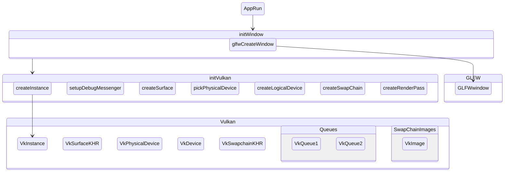

# Vulkan Diagrams 

<!-- vscode-markdown-toc -->

<!-- vscode-markdown-toc-config
	numbering=false
	autoSave=true
	/vscode-markdown-toc-config -->
<!-- /vscode-markdown-toc -->

## Flow Chart

```mermaid


stateDiagram-v2

    AppRun
    AppRun --> initWindow
    createInstance --> VkInstance
    glfwCreateWindow --> GLFWwindow
    initWindow --> initVulkan

    state initWindow {
        glfwCreateWindow
    }

    state initVulkan {
        createInstance
        setupDebugMessenger
        createSurface
        pickPhysicalDevice
        createLogicalDevice
        createSwapChain
        createRenderPass
    }

    state Vulkan {
        VkInstance
        VkSurfaceKHR
        VkPhysicalDevice
        VkDevice
        VkSwapchainKHR

        state Queues {
            VkQueue1
            VkQueue2
        }
        state SwapChainImages {
            VkImage
        }
    }

    state GLFW {
        GLFWwindow
    }
```