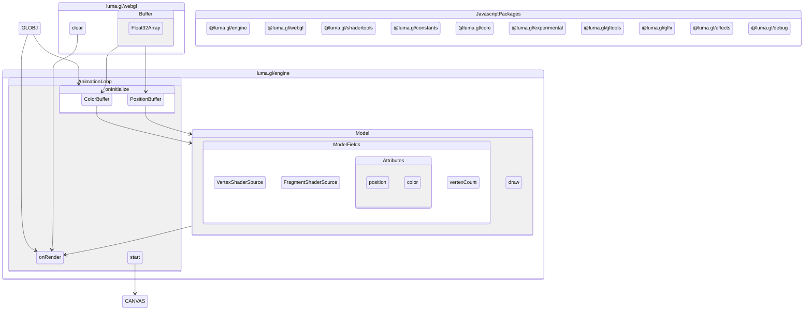

```mermaid
%% Start Diagram 

stateDiagram-v2

    GLOBJ --> onInitialize

    GLOBJ --> onRender
    Model --> onRender
    Buffer --> ColorBuffer
    Buffer --> PositionBuffer

    ColorBuffer --> Model
    PositionBuffer --> Model

    clear --> onRender

    start --> CANVAS

    state JavascriptPackages {
        @luma.gl/engine
        @luma.gl/webgl
        @luma.gl/shadertools
        @luma.gl/constants
        @luma.gl/core
        @luma.gl/experimental
        @luma.gl/gltools
        @luma.gl/glfx
        @luma.gl/effects
        @luma.gl/debug
    }

    GLOBJ

    CANVAS

    state luma.gl/webgl {
        state Buffer {
            Float32Array
        }
        clear
    }

    state luma.gl/engine {

        state AnimationLoop {
            state onInitialize {
                PositionBuffer
                ColorBuffer

            }

            onRender

            start
        }

        state Model {
            state ModelFields {
                VertexShaderSource
                FragmentShaderSource
                state Attributes {
                    position
                    color
                }
                vertexCount
            }
            draw
        }
    }

%% End Diagram
```

    