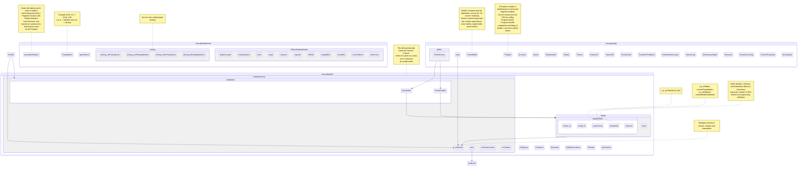

```mermaid
%% Start Diagram 

stateDiagram-v2

    GLOBJ --> onInitialize

    GLOBJ --> onRender
    Model --> onRender
    Buffer --> ColorBuffer
    Buffer --> PositionBuffer

    ColorBuffer --> Model
    PositionBuffer --> Model

    clear --> onRender

    start --> CANVAS

    GLOBJ

    CANVAS

    state luma.gl/webgl {
        state Buffer {
            Float32Array
        }
        FrameBuffer

        note left of FrameBuffer
            WebGL Container that the application can use for "off screen" rendering
            Doesn't contain image data but contains attachments (color buffers, depth buffer, stencil buffer)
        end note

        Program

        note left of Program
            A Program contains a matched pair of vertex and fragment shaders.
            Can be exectued on the GPU by calling Program.draw(). 
            Programs handle compilation and linking of shaders, and store uniform values. 
        end note
        
        Accessor
        Query
        Renderbuffer
        Shader
        Texture
        Texture2D
        Texture3D
        TextureCube
        TransformFeedback
        UniformBufferLayout
        VertexArray
        VertexArrayObject
        Resource
        FeatureChecking
        ContextProperties
        MovingData
        clear
    }

    state luma.gl/shadertools {
        assembleShaders
        note left of assembleShaders
            Deals with taking source code of shaders
            and Composing Vertex / Fragment Sources with 'Shader Modules',
            'hook functions' and injections to produce the final Sources used
            by the Program
        end note
        Transpilation
        note left of Transpilation
            Transpile GLSL 3.0 -> GLSL 1.00
            e.g. in -> attribute and out -> varying
        end note

        getUniforms

        state picking {

            picking_setPickingColor
            picking_setPickingAttribute
            picking_filterPickingColor
            picking_filterHighlightColor

        }
        note left of picking
            Use for color coding based picking
        end note

        state EffectsShaderModule {
            brightContrast
            hueSaturation
            noise
            sepia
            vibrance
            vignette
            tiltShift
            triangleBlur
            zoomBlur
            colorHalftone
            dotScreen
        }

    

    }

    state luma.gl/engine {

        ClipSpace

        state AnimationLoop {
            state onInitialize {
                PositionBuffer
                ColorBuffer

            }
            onCreateContext
            onRender
            onFinalize
            start

            note left of onRender 
                Manages resizing of canvas, viewport and framebuffer
            end note
        }

        note left of AnimationLoop 
            This will automatically create the Canvas / Context 
            unless it is given as a prop in its constructor
            gl: yourglcontext
        end note


        state Model {
            state ModelFields {
                model_vs
                model_fs
                vertexCount
                drawMode
                note left of drawMode
                    e.g. gl.TRIANGLE_FAN
                end note
                uniforms
                note left of uniforms
                    e.g. uPMatrix: currentProjectMatrix,
                    e.g. uMVMatrix: currentModelViewMatrix
                end note
            }
            draw
        }

        note left of Model 
            Holds Shaders, Uniforms, VertexAttributes (Mesh or Geometry)
            Automatic creation of GPU Buffers from typed array attributes
        end note

        Transform
        Geometry
        BuiltinGeometries
        Timeline
        KeyFrames
        
    }

%% End Diagram
```

    