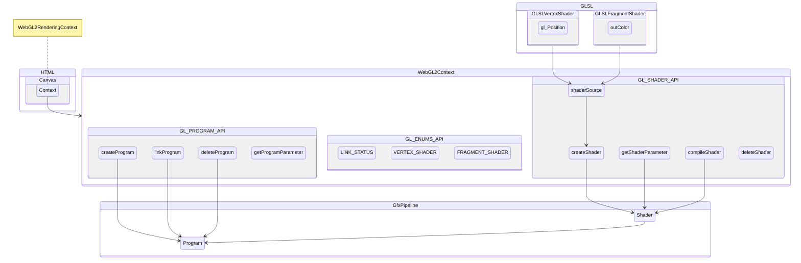

```mermaid
%% Start Diagram 

stateDiagram-v2

    state HTML {
        state Canvas {
            Context
            note left of Context
                WebGL2RenderingContext
            end note
        }
    }

    Context --> WebGL2Context 

    state GfxPipeline {
        Program
        Shader
    }

    createProgram --> Program
    linkProgram --> Program
    deleteProgram --> Program
    Shader --> Program

    createShader --> Shader
    GLSLVertexShader --> shaderSource
    GLSLFragmentShader --> shaderSource
    shaderSource --> createShader
    getShaderParameter --> Shader
    compileShader --> Shader


    state WebGL2Context {
        state GL_PROGRAM_API {
            createProgram
            linkProgram
            deleteProgram 
            getProgramParameter
        }


        state GL_ENUMS_API {
            LINK_STATUS
            VERTEX_SHADER
            FRAGMENT_SHADER
        }

        state GL_SHADER_API {
            createShader
            shaderSource
            deleteShader
            getShaderParameter
            compileShader
        }


    }

    state GLSL {
        state GLSLVertexShader {
            gl_Position
        }

        state GLSLFragmentShader {
            outColor
        }

    }


%% End Diagram
```

    