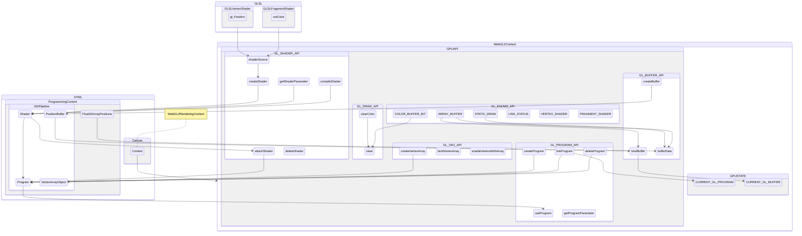

```mermaid
%% Start Diagram 

stateDiagram-v2

    %% State Transitions %%
    Context --> WebGL2Context 

    createProgram --> Program
    linkProgram --> Program
    deleteProgram --> Program
    Shader --> Program
    Program --> useProgram
    linkProgram --> CURRENT_GL_PROGRAM

    createShader --> Shader
    GLSLVertexShader --> shaderSource
    GLSLFragmentShader --> shaderSource
    shaderSource --> createShader
    getShaderParameter --> Shader
    compileShader --> Shader
    Shader --> attachShader 
    attachShader --> Program

    clearColor --> clear
    COLOR_BUFFER_BIT --> clear

    createBuffer --> PositionBuffer
    ARRAY_BUFFER --> bindBuffer
    PositionBuffer --> bindBuffer
    ARRAY_BUFFER --> bufferData
    Float32ArrayPositions --> bufferData
    STATIC_DRAW --> bufferData
    bindBuffer --> CURRENT_GL_BUFFER

    createVertexArray --> VertexArrayObject


    %% States %%
    state HTML {
        state Canvas {
            Context
            note left of Context
                WebGL2RenderingContext
            end note
        }

        state ProgrammingContext {
            Float32ArrayPositions

            state GfxPipeline {
                Program
                Shader
                PositionBuffer
                VertexArrayObject
            }
        }

    }


    state WebGL2Context {

        state GPUSTATE {
            CURRENT_GL_BUFFER
            CURRENT_GL_PROGRAM
        }

        state GPUAPI {

            state GL_PROGRAM_API {
                createProgram
                linkProgram
                deleteProgram 
                useProgram
                getProgramParameter
            }

            state GL_DRAW_API {
                clearColor
                clear
            }


            state GL_ENUMS_API {
                LINK_STATUS
                VERTEX_SHADER
                FRAGMENT_SHADER
                COLOR_BUFFER_BIT
                ARRAY_BUFFER
                STATIC_DRAW
            }

            state GL_SHADER_API {
                createShader
                shaderSource
                deleteShader
                attachShader
                getShaderParameter
                compileShader
            }

            state GL_BUFFER_API {
                createBuffer
                bindBuffer
                bufferData
            }

            state GL_VAO_API {
                createVertexArray
                bindVertexArray
                enableVertexAttribArray
            }

        }


    }

    state GLSL {
        state GLSLVertexShader {
            gl_Position
        }

        state GLSLFragmentShader {
            outColor
        }

    }


%% End Diagram
```

    